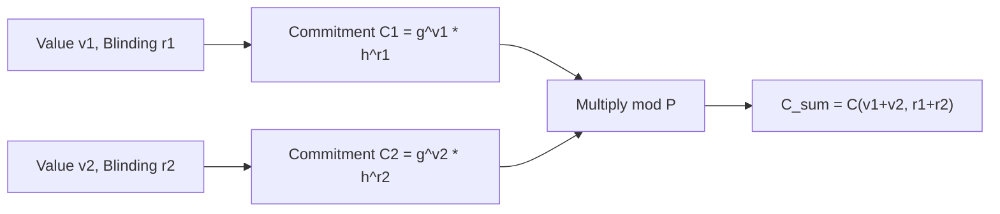

# Pedersen Commitment Scheme Skill

High-efficiency, zero-dependency Python implementation of **Pedersen Commitments** for privacy-preserving verifiable transactions.

## Features
- **Perfect Information-Theoretic Hiding**: Commitments reveal nothing about underlying private balances.
- **Computational Binding**: Bound to discrete logarithm hardness over cyclic subgroup generators.
- **Additive Homomorphism**: \(C(v_1, r_1) \cdot C(v_2, r_2) \equiv C(v_1 + v_2, r_1 + r_2) \pmod p\).
- **Zero External Dependencies**: Pure Python standard library.
- **Native MCP Protocol**: JSON-RPC 2.0 stdio server compatible with Claude Desktop, Cursor, and Windsurf.

## Architecture

